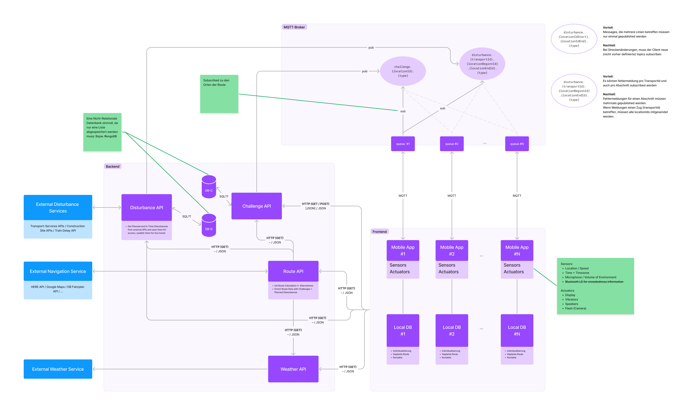

# [ADR](./README.md) › Spezifikation der Systemarchitektur

<table>
<tr>
<th>status</th>
<td>proposed</td><!-- {proposed / rejected / accepted / deprecated / … / superseded by ADR-0005 <0005-example.md>} -->
</tr>
<tr>
<th>date</th>
<td>2023-04-XX</td><!-- YYYY-MM-DD, when the decision was last updated -->
</tr>
<tr>
<th>deciders</th>
<td>Finn Gedrath, Leonard Pelzer</td><!-- list everyone involved in the decision -->
</tr>
<tr>
<th>consulted</th>
<td></td><!-- list everyone whose opinions are sought (typically subject-matter experts); and with whom there is a two-way communication -->
</tr>
<tr>
<th>informed</th>
<td></td><!-- list everyone who is kept up-to-date on progress; and with whom there is a one-way communication -->
</tr>
</table>

## Kontext und Problemstellung

{Beschreiben Sie den Kontext und die Problemstellung, z. B. in freier Form in zwei bis drei Sätzen oder in Form einer anschaulichen Geschichte. Möglicherweise möchten Sie das Problem in Form einer Frage formulieren und Links zu Kollaborationsforen oder Problemverwaltungssystemen hinzufügen}.

In der System-Architektur werden System-Komponenten und ihre Komunikationspfade definiert. Im Zusammenspiel setzen diese die definierten Use Cases um. Die System-Komponenten bilden setzen ihren definierten Scope um. Die Entscheidung, welches Paradgima umgesetzt wird hängt zum einen von den definierten Anforderungen und von technischen Möglichkeiten/Sub-ADRs ab. Hierfür gilt es Alternativen und Fallbacks einzuplanen.

<!-- Dies ist ein optionales Element. Sie können es gerne entfernen.
## Entscheidungstreiber

* {Entscheidungstreiber 1, z.B. eine Kraft, ein Anliegen, ...}
* {Entscheidungstreiber 2, z.B. eine Kraft, die Bedenken hat, ...}

-->

## In Betracht gezogene Optionen

* Dimension: Kommunikations-Art
  * sycnhron
  * asynchron
  * mixed-synchron-asynchron
* Dimension: System Aufbau
  * monolythisch
  * verteilt

## Ergebnis der Entscheidung

Gewählte Option: "{Titel der Option 1}", weil
{Begründung. z.B., einzige Option, die das K.O.-Kriterium Entscheidungstreiber erfüllt | die Kraft {Kraft} auflöst | ... | am besten ausfällt (siehe unten)}.

<!-- Dies ist ein optionales Element. Sie können es gerne entfernen. -->
### Consequences

* Gut, weil {positive Folge, z.B. Verbesserung einer oder mehrerer gewünschter Eigenschaften, ...}
* Schlecht, weil {negative Konsequenz, z.B. Beeinträchtigung einer oder mehrerer gewünschter Eigenschaften, ...}
* ... <!-- Anzahl der Konsequenzen kann variieren -->

<!-- Dies ist ein optionales Element. Fühlen Sie sich frei, es zu entfernen. -->
## Validierung

{beschreibt, wie die Umsetzung/Einhaltung des ADR validiert wird. Z.B. durch eine Überprüfung oder einen ArchUnit-Test}

<!-- Dies ist ein optionales Element. Sie können es gerne entfernen. -->
## Pro und Kontra der Optionen

### {Titel der Option 1}

<!-- Dies ist ein optionales Element. Sie können es gerne entfernen. -->
{Beispiel / Beschreibung / Verweis auf weitere Informationen / ...}

* Gut, denn {Argument a}
* Gut, weil {Argument b}
<!-- Verwende "neutral", wenn das angegebene Argument weder für gut noch für schlecht gewichtet ist -->
* Neutral, weil {Argument c}
* Schlecht, weil {Argument d}
* ... <!-- Anzahl der Vor- und Nachteile kann variieren -->

### {Titel der anderen Option}

{Beispiel / Beschreibung / Verweis auf weitere Informationen / ...}

* Gut, weil {Argument a}
* Gut, weil {Argument b}
* Neutral, weil {Argument c}
* Schlecht, weil {Argument d}
* ...

<!-- Dies ist ein optionales Element. Sie können es gerne entfernen. -->
## Weitere Informationen

{Vielleicht möchten Sie hier zusätzliche Beweise/Vertrauenswürdigkeit für das Entscheidungsergebnis angeben und/oder die Einigung des Teams auf die Entscheidung dokumentieren und/oder definieren, wann und wie diese Entscheidung umgesetzt werden sollte und ob/ wann sie erneut überprüft werden sollte und/oder wie die Entscheidung validiert wird. Hier können auch Links zu anderen Entscheidungen und Ressourcen erscheinen.}